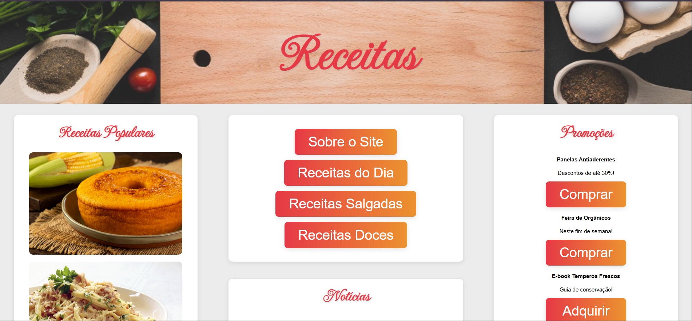

# 🍽️ Receitas

Um site simples, intuitivo e em constante evolução, pensado para **todos os públicos**: desde quem já domina as panelas até quem mal sabe fritar um ovo. 🥚🔥

Este projeto nasceu com o objetivo de **compartilhar receitas** de forma acessível, organizada e visualmente agradável. Está sendo desenvolvido com foco em **usabilidade**, **responsividade** e uma pitada de estilo. 😉

---

## 📸 Preview

---

## 🚧 Status do Projeto

🛠️ **Em construção!**  
Atualmente, o site já possui:

- Página inicial com imagem destacada e menus visuais
- Sessão de **Receitas Populares**
- Área de **Promoções e Dicas**
- Área de **Noticias**
- Página de **Receita do dia**
- Página **Sobre o Site** (Ainda não completa)

### ✅ Em breve:
- Filtros para categorias de receitas
- Campo de **receitas favoritas**
- Área de **login e cadastro**
- Melhorias para **uso mobile**
- Incrementação das outras Páginas de **Receitas Salgadas** e **Receitas Doces**
- Mais receitas, imagens e interações

---

## 💻 Tecnologias utilizadas

- **HTML5**
- **CSS3**

*Sem frameworks (até o momento) — feito na unha!*

---

## 📌 Objetivo

Criar um site completo e visualmente atraente, que possa ser usado como:

- Portfólio pessoal
- Ferramenta real para aprendizado
- Base para evoluir com JavaScript e back-end futuramente

---

## 👨‍🍳 Autor

Desenvolvido por **Lucas Ribeiro**, aprendizado contínuo e agora também por pratos bem apresentados na web. 🍝

[🔗 LinkedIn](https://www.linkedin.com/in/lucas-ribeiro-461950203/) | [🐙 GitHub](https://github.com/ri-beiro) | [📧 Email](mailto:lucas.riceirao11@gmail.com)

---

## 📝 Licença

Este projeto está sob a licença **MIT** – sinta-se à vontade para estudar, adaptar e contribuir.
